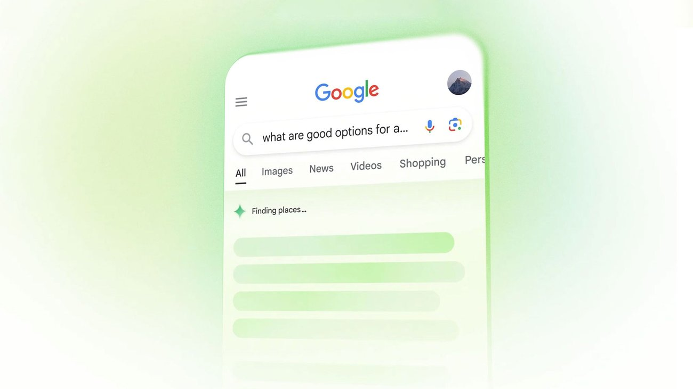

## Something Has Quietly Changed About How People Search

Think about the last time you searched something simple. Did you scroll through ten blue links? Or did you just read the answer at the top of the page and move on with your day?

That answer at the top — the one in the box, or the AI summary — that's not from a single website you actually visited. It's pulled, summarised, and served to you directly. No click needed. You got what you wanted, the website you would've clicked on never even saw your visit.

This is the shift that's happening right now. And it's why something called AEO is suddenly worth paying attention to.

## What is AEO?

AEO stands for Answer Engine Optimisation. It's the practice of writing and structuring your content so that AI tools and search engines can pull a clear, direct answer from it when someone asks a question. Where SEO is about ranking on a results page, AEO is about *being* the answer that gets surfaced — whether that's a Google AI Overview, a ChatGPT response, a Perplexity citation, or a voice assistant reply.

The goal of AEO is simple. When someone asks an AI a question your content could answer — your content should be the one it picks.

## How is AEO Different from SEO?
SEO and AEO aren't opposites. They're cousins, really. Good SEO still matters — it's how AI tools find your content in the first place. But the goal of each is different, and that changes how you write.

**SEO is about winning a ranking.** You optimise for keywords, backlinks, and page authority. The result shows up on a search results page, where a user clicks your link. It rewards topic depth and authority.

**AEO is about winning a direct answer.** You optimise for clarity, structure, and specificity. The result shows up in an AI summary or assistant reply — the user reads the answer and moves on. It rewards direct, quotable, well-structured content.

The simplest way to think about it — SEO asks *can Google find and rank this page*. AEO asks *can an AI read this page and pull a clear, confident answer from it*. One is about visibility. The other is about being useful in a world where the search result itself is the destination.

## Why Does AEO Matter Right Now?

AEO matters right now because the way people search is changing faster than most websites are updating. AI assistants are getting better, Google is showing AI summaries above the regular results, and Perplexity is growing fast in India. More and more search journeys are ending without a single click.

If someone asks *best branding studio in Chennai* or *what does a creative tech studio do* — and an AI answers that question for them — which content does the AI pull from?

It pulls from whoever wrote the clearest, most direct, most trustworthy answer on that topic. Not always the biggest site. Not always the one with the most backlinks. The one that was easiest to read and most directly answered the question being asked.

> The web used to feel like a library. Now it feels more like asking a well-read friend. AEO is about being the friend they end up quoting.

That's a real opportunity for smaller studios, indie founders, and creators who actually write well. The big sites with huge SEO teams don't automatically win in this new game. The ones who write clearly do.

## How Do You Optimise Content for AEO?

You can optimise content for AEO by writing every section like it's answering one specific question — clearly, directly, and within the first two sentences. Here are the things that genuinely move the needle:

**Use questions as headings.** If someone is likely to ask *what is AEO* — make that your section heading. AI tools scan headings to understand what each section is about. A heading that *is* a question is a clear signal that the answer follows.

**Answer the question in the first two sentences.** Don't build up. Don't set the scene. Just answer it. Then explain, expand, give examples. This one habit alone makes your content way more quotable.

**Use simple, confident language.** Hedging and overexplaining gets skipped. Strong, direct sentences get picked up. If you can say *X is Y because Z*, say it that way.

**Structure your content properly.** Short paragraphs. One idea per section. Logical flow from question to answer. Walls of text don't get quoted by AI. Clean structure does.

**Be specific.** Vague content doesn't get cited anywhere — not by Google, not by ChatGPT, not by humans. *Branding matters a lot* tells an AI nothing. *A consistent visual identity makes a brand 3.5 times more recognisable* (or whatever real number you have) is something the AI can actually work with.

**Build trust signals.** Author names, publish dates, a real point of view, links to credible sources. AI systems use these to decide whether your content is worth surfacing in the first place.

## Does AEO Replace SEO?

No — AEO doesn't replace SEO, it sits on top of it. Your content still needs to be discoverable, your site still needs decent technical health, and backlinks still matter for trust. AEO just adds a new layer — once your page is *findable*, the question becomes whether it's *quotable*.

Think of it like this. SEO gets you into the room. AEO gets you remembered after you've spoken. You need both.

## The Honest Truth About AEO

AEO isn't a magic hack. It isn't a checklist you run through once and forget. It's a small but real shift in how you think about writing.

When we write for Since That Friday — these blogs, our case studies, even our project descriptions — we're thinking about both at once. *Will a person find this useful? And will an AI be able to understand and quote it cleanly?*

Most of the time those two things have the same answer. Write for humans first, write clearly, write with a real point of view. The AI will follow.

SEO took years for everyone to figure out. AEO is still being figured out by everyone — including the AI tools themselves. Which means right now is actually a really good moment to start. The ones who write well and write consistently are going to have a real edge over the ones still hoping for keyword tricks to save them.

The search bar is changing. Your content strategy probably should too.